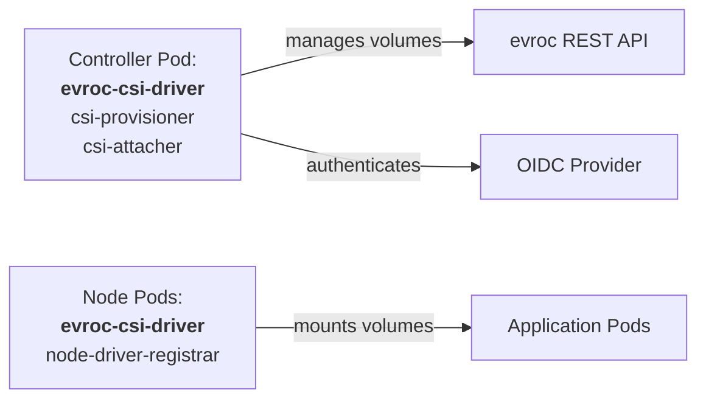
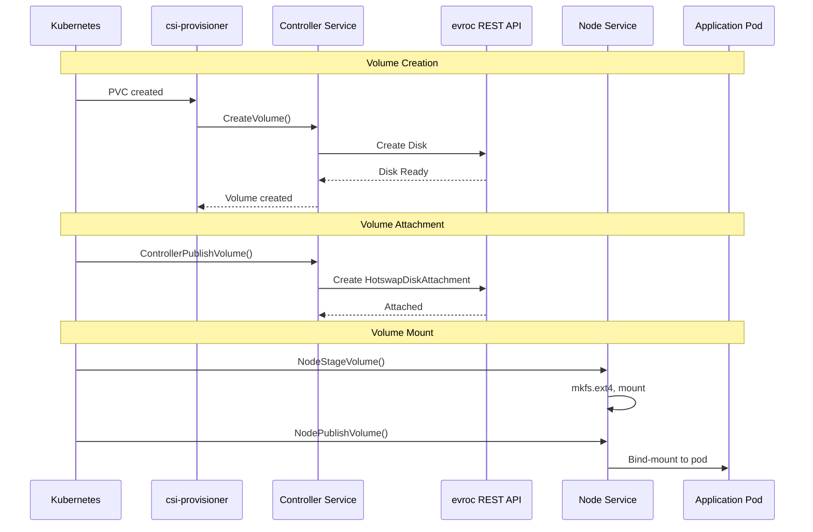

# evroc CSI Driver - Architecture Overview

This document describes the architecture of the evroc CSI driver, a production-ready Container Storage Interface (CSI) driver that integrates with the evroc cloud platform via REST API.

## Component Overview

### Deployment Structure



### Communication Flow



## CSI Services Implementation

The driver implements all three required CSI services with full production functionality:

### 1. Identity Service
**Location**: `pkg/identity/identity.go`

**Purpose**: Provides driver metadata and capabilities

**RPCs Implemented**:
- `GetPluginInfo()` - Returns driver name (`disk.csi.evroc.com`) and version
- `GetPluginCapabilities()` - Declares CSI service capabilities (Controller Service)
- `Probe()` - Health check endpoint

### 2. Controller Service
**Location**: `pkg/controller/controller.go`

**Purpose**: Manages volume lifecycle through evroc REST API

**RPCs Implemented**:
- `CreateVolume()` - Creates a Disk resource via REST API with topology-aware zone placement
- `DeleteVolume()` - Deletes a Disk resource via REST API
- `ControllerPublishVolume()` - Creates a HotswapDiskAttachment to attach disk to VM
- `ControllerUnpublishVolume()` - Deletes HotswapDiskAttachment to detach disk
- `ValidateVolumeCapabilities()` - Validates access modes (RWO, RWOPod, ROX) and volume type (filesystem/block)
- `ListVolumes()` - Lists all Disk resources via REST API
- `GetCapacity()` - Returns configured total capacity quota
- `ControllerGetCapabilities()` - Returns supported capabilities
- `ControllerGetVolume()` - Retrieves volume status from REST API

**Key Concepts**:
- **OIDC/OAuth2 authentication**: Automatic token refresh for REST API calls
- **Idempotent operations**: Safe retry behavior with proper error handling
- **Topology-aware provisioning**: Zone placement based on Kubernetes node labels
- **Resource ownership tracking**: Sets labels on Disk and HotswapDiskAttachment resources via evroc REST API with CSI identifier. Prevents modification/deletion of unlabelled resources. Note: This feature is disabled by default, pending availability of labels in the evroc REST API.
- **Exponential backoff**: Retry logic for transient API errors
- **Prometheus metrics**: Operation counters, latency histograms, and error tracking

### 3. Node Service
**Location**: `pkg/node/node.go`

**Purpose**: Handles volume staging and publishing on worker nodes

**RPCs Implemented**:
- `NodeStageVolume()` - Formats the block device with ext4 filesystem at staging path
- `NodeUnstageVolume()` - Unmounts and cleans up staged volume
- `NodePublishVolume()` - Bind-mounts volume from staging path to pod target path
- `NodeUnpublishVolume()` - Unmounts volume from pod
- `NodeGetVolumeStats()` - Returns real volume statistics (capacity, usage, inodes)
- `NodeGetCapabilities()` - Returns node capabilities (STAGE_UNSTAGE_VOLUME, GET_VOLUME_STATS)
- `NodeGetInfo()` - Returns node information including topology zone from Kubernetes API

**Key Concepts**:
- **Filesystem formatting**: ext4 formatting via `mkfs.ext4`
- **Device detection**: Attachment identification via `/dev/disk/by-id/` symlinks
- **Signature detection**: Uses `blkid` to detect existing filesystems
- **Mount operations**: Idempotent mount/unmount with proper cleanup
- **Read-only support**: ROX access mode via read-only mount flag
- **Zone detection**: Node topology via Kubernetes node labels (`topology.kubernetes.io/zone`) on customer clusters

## Storage Backend Architecture

### REST API Client
**Location**: `pkg/evroc/rest/`

The driver integrates with evroc's REST API (v1alpha2) to manage persistent storage:

**Disk Operations**:
- `CreateDisk(ctx, name, sizeMB, zone, storageClass)` - Creates a Disk resource with specified zone
- `GetDisk(ctx, name)` - Retrieves Disk status with Ready condition checking
- `DeleteDisk(ctx, name)` - Deletes Disk resource
- `ListDisks(ctx)` - Lists all Disk resources in the project
- `WaitForDiskReady(ctx, name, timeout)` - Polls until Disk Ready condition is True

**Attachment Operations**:
- `AttachDisk(ctx, diskName, vmName)` - Creates HotswapDiskAttachment resource
- `DetachDisk(ctx, attachmentName)` - Deletes HotswapDiskAttachment resource
- `GetAttachment(ctx, attachmentName)` - Retrieves attachment status and serial number
- `ListAttachments(ctx)` - Lists all HotswapDiskAttachment resources
- `WaitForAttachmentReady(ctx, attachmentName, timeout)` - Polls until attachment Ready condition is True

**API Endpoint Structure**:
```
https://api.cloud.evroc.com/apis/compute/v1alpha2/
  organizations/{org}/
    projects/{proj}/
      disks/{name}
      hotswap-disk-attachments/{name}
```

### Authentication
**Location**: `pkg/auth/`

**OIDC/OAuth2 Flow**:
1. Driver starts, reads credentials from configuration
2. Authenticates to the evroc API (using OIDC) with Resource Owner Password Credentials (ROPC) flow
3. Receives JWT access token and refresh token
4. Automatic background token refresh before expiration
5. All REST API calls include `Authorization: Bearer {token}` header

**Security Features**:
- Credentials stored in Kubernetes Secrets
- Tokens cached in memory, never persisted to disk
- Automatic retry on authentication failures
- Thread-safe token refresh mechanism

## Deployment Architecture

```
┌────────────────────────────────────────────────────────────┐
│                  Kubernetes Cluster                        │
│                                                            │
│  ┌───────────────────────────────────────────────────────┐ │
│  │                    Control Plane                      │ │
│  │                                                       │ │
│  │  ┌──────────────────────────────────────────────────┐ │ │
│  │  │  CSI Controller Pod (Deployment)                 │ │ │
│  │  │                                                  │ │ │
│  │  │  ┌─────────────────┐                             │ │ │
│  │  │  │ evroc-csi-driver│  Main CSI driver binary     │ │ │
│  │  │  │ (Controller)    │  - Identity Service         │ │ │
│  │  │  │                 │  - Controller Service       │ │ │
│  │  │  │                 │  - REST API Client          │ │ │
│  │  │  │                 │  - OIDC Authentication      │ │ │
│  │  │  │                 │  - Metrics Collection       │ │ │
│  │  │  │ Socket:         │                             │ │ │
│  │  │  │ /csi/csi.sock   │                             │ │ │
│  │  │  └────────┬────────┘                             │ │ │
│  │  │           │                                      │ │ │
│  │  │  ┌────────▼─────────┐  ┌─────────────────────┐   │ │ │
│  │  │  │ csi-provisioner  │  │  csi-attacher       │   │ │ │
│  │  │  │ (sidecar)        │  │  (sidecar)          │   │ │ │
│  │  │  │                  │  │                     │   │ │ │
│  │  │  │ Handles:         │  │  Handles:           │   │ │ │
│  │  │  │ - PVC → PV       │  │  - VolumeAttachment │   │ │ │
│  │  │  │ - CreateVolume   │  │  - ControllerPublish│   │ │ │
│  │  │  │ - DeleteVolume   │  │  - ControllerUnpub. │   │ │ │
│  │  │  └──────────────────┘  └─────────────────────┘   │ │ │
│  │  │                                                  │ │ │
│  │  │  Configuration:                                  │ │ │
│  │  │  - Secret: evroc-csi-config                      │ │ │
│  │  │  - OIDC credentials                              │ │ │
│  │  │  - REST API endpoint                             │ │ │
│  │  └──────────────────────────────────────────────────┘ │ │
│  └───────────────────────────────────────────────────────┘ │
│                                                            │
│  ┌──────────────────────────────────────────────────────┐  │
│  │                  Worker Nodes                        │  │
│  │                                                      │  │
│  │  ┌──────────────┐  ┌──────────────┐  ┌─────────────┐ │  │
│  │  │ Node-1       │  │ Node-2       │  │ Node-3      │ │  │
│  │  │ Zone: a      │  │ Zone: a      │  │ Zone: b     │ │  │
│  │  │              │  │              │  │             │ │  │
│  │  │ ┌──────────┐ │  │ ┌──────────┐ │  │ ┌─────────┐ │ │  │
│  │  │ │CSI Node  │ │  │ │CSI Node  │ │  │ │CSI Node │ │ │  │
│  │  │ │(DaemonSet│ │  │ │(DaemonSet│ │  │ │(DS Pod) │ │ │  │
│  │  │ │   Pod)   │ │  │ │   Pod)   │ │  │ │         │ │ │  │
│  │  │ │          │ │  │ │          │ │  │ │         │ │ │  │
│  │  │ │┌────────┐│ │  │ │┌────────┐│ │  │ │┌───────┐│ │ │  │
│  │  │ ││driver  ││ │  │ ││driver  ││ │  │ ││driver ││ │ │  │
│  │  │ ││+ Node  ││ │  │ ││+ Node  ││ │  │ ││+ Node ││ │ │  │
│  │  │ ││Service ││ │  │ ││Service ││ │  │ ││Service││ │ │  │
│  │  │ ││+ FS Ops││ │  │ ││+ FS Ops││ │  │ ││+ FS   ││ │ │  │
│  │  │ │└───┬────┘│ │  │ │└───┬────┘│ │  │ │└───┬───┘│ │ │  │
│  │  │ │    │     │ │  │ │    │     │ │  │ │    │    │ │ │  │
│  │  │ │┌───▼────┐│ │  │ │┌───▼────┐│ │  │ │┌───▼───┐│ │ │  │
│  │  │ ││registr.││ │  │ ││registr.││ │  │ ││registr││ │ │  │
│  │  │ ││sidecar ││ │  │ ││sidecar ││ │  │ ││sidecar││ │ │  │
│  │  │ │└────────┘│ │  │ │└────────┘│ │  │ │└───────┘│ │ │  │
│  │  │ └──────────┘ │  │ └──────────┘ │  │ └─────────┘ │ │  │
│  │  │              │  │              │  │             │ │  │
│  │  │ App Pods...  │  │ App Pods...  │  │ App Pods... │ │  │
│  │  │ /dev/sda     │  │ /dev/sdb     │  │ /dev/sdc    │ │  │
│  │  └──────────────┘  └──────────────┘  └─────────────┘ │  │
│  └──────────────────────────────────────────────────────┘  │
└────────────────────────────────────────────────────────────┘
```

## Communication Flow

### gRPC Over Unix Socket

All CSI communication happens over Unix domain sockets:

**Controller Socket**: `/csi/csi.sock` (in controller pod)
- csi-provisioner ↔ CSI Controller Service
- csi-attacher ↔ CSI Controller Service

**Node Socket**: `/csi/csi.sock` (in each node pod)
- kubelet ↔ CSI Node Service
- node-driver-registrar ↔ CSI Identity Service

### Service Registration

1. Controller pod starts:
   - Driver loads configuration from `/etc/evroc-csi/config.yaml`
   - Authenticates to the evroc API (using OIDC)
   - Creates REST API client with OAuth2 token
   - Creates Unix socket at `/csi/csi.sock` for gRPC communication
   - Sidecar containers access the same socket file to send RPC requests to the driver

2. Node pod starts on each node:
   - Driver registers Identity and Node services on Unix socket
   - node-driver-registrar registers driver with kubelet
   - Queries Kubernetes API for node zone label
   - kubelet can now call Node RPCs for volume mounting

## Feature Support

### Volume Operations
- **Create**: Disk resources via REST API with zone placement
- **Delete**: Disk resource deletion with ownership validation
- **Attach**: HotswapDiskAttachment for VM disk attachment
- **Detach**: Attachment resource cleanup
- **Stage**: ext4 formatting and mount at staging path
- **Publish**: Bind-mount from staging to pod target path
- **Statistics**: Volume usage metrics via statfs syscall

### Access Modes
- **ReadWriteOnce (RWO)**: Single node read-write access
- **ReadWriteOncePod (RWOPod)**: Single pod read-write access
- **ReadOnlyMany (ROX)**: Multiple nodes read-only (filesystem only)

### Volume Types
- **Filesystem**: ext4 formatted volumes with automatic formatting
- **Block**: Raw block device access without filesystem

### Additional Capabilities
- **Topology awareness**: Zone-based scheduling using Kubernetes topology labels
- **OIDC authentication**: Token-based authentication with automatic refresh
- **Idempotent operations**: Safe retry behavior for all operations
- **Metrics collection**: Prometheus metrics for observability
- **Resource ownership**: Sets CSI identifier labels on evroc API resources for multi-cluster scenarios
- **Error handling**: Exponential backoff retry for transient errors
- **Node attach limit**: Configurable maximum volumes per node (default: 128)

## Limitations

**Filesystem Support**:
- Only ext4 filesystem is supported
- Other filesystems (xfs, btrfs, etc.) are not implemented

**Volume Features**:
- Volume snapshots not implemented
- Volume cloning not implemented
- Volume expansion not implemented

**Access Modes**:
- ReadWriteMany (RWX) not supported
- ReadOnlyMany (ROX) for block volumes not supported

## Security Architecture

### Credential Management
- OIDC credentials stored in Kubernetes Secrets
- Configuration mounted read-only from Secret volume
- No credentials in environment variables
- Tokens cached in memory only (never persisted)
- Controller pods have credentials, node pods do not

### RBAC Permissions
The driver requires minimal Kubernetes RBAC permissions:
- Controller: Read `nodes` for topology zone detection
- Controller: Read/write `events` for event recording
- Node: No Kubernetes API permissions required

### Network Security
- All REST API calls over HTTPS
- TLS certificate validation enabled
- OAuth2 Bearer token authentication
- No plain HTTP fallback

## Observability

### Prometheus Metrics
**Endpoint**: `:8080/metrics` (controller pod only)

**Volume Metrics**:
- `evroc_csi_volume_operations_total` - Counter by operation and status
- `evroc_csi_volume_operations_duration_seconds` - Histogram of operation latency
- `evroc_csi_volume_operations_errors_total` - Counter by operation and error type
- `evroc_csi_volumes_total` - Gauge of volumes by state
- `evroc_csi_volume_size_bytes` - Gauge of volume sizes

**Node Metrics**:
- `evroc_csi_node_operations_total` - Counter by operation and status
- `evroc_csi_node_operations_duration_seconds` - Histogram of operation latency
- `evroc_csi_node_operations_errors_total` - Counter by operation and error type

**Attachment Metrics**:
- `evroc_csi_attachments_total` - Gauge of attachments by state

**API Metrics**:
- `evroc_csi_api_calls_total` - Counter by method and status
- `evroc_csi_api_calls_duration_seconds` - Histogram of API call latency
- `evroc_csi_api_calls_errors_total` - Counter by method and error type

### Logging
Structured logging using `log/slog` with levels:
- **Debug**: Detailed operation traces
- **Info**: Standard operation logs
- **Warn**: Recoverable errors and retries
- **Error**: Unrecoverable errors

## References

- [CSI Specification](https://github.com/container-storage-interface/spec)
- [Kubernetes CSI Documentation](https://kubernetes-csi.github.io/docs/)
- [CSI Driver Development Guide](https://kubernetes-csi.github.io/docs/developing.html)
- [evroc REST API Documentation](https://api.cloud.evroc.com/docs)
