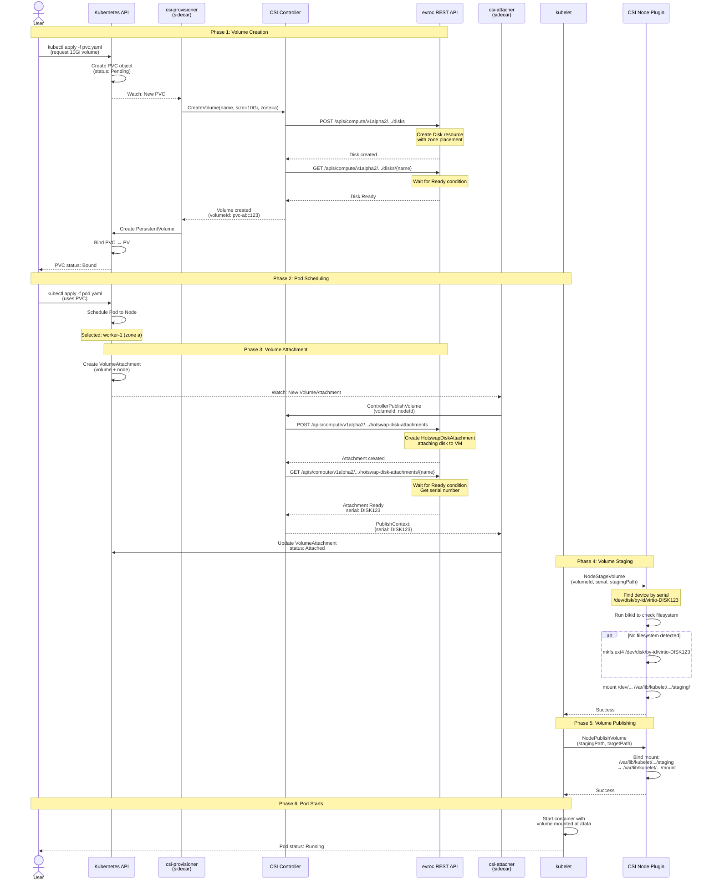
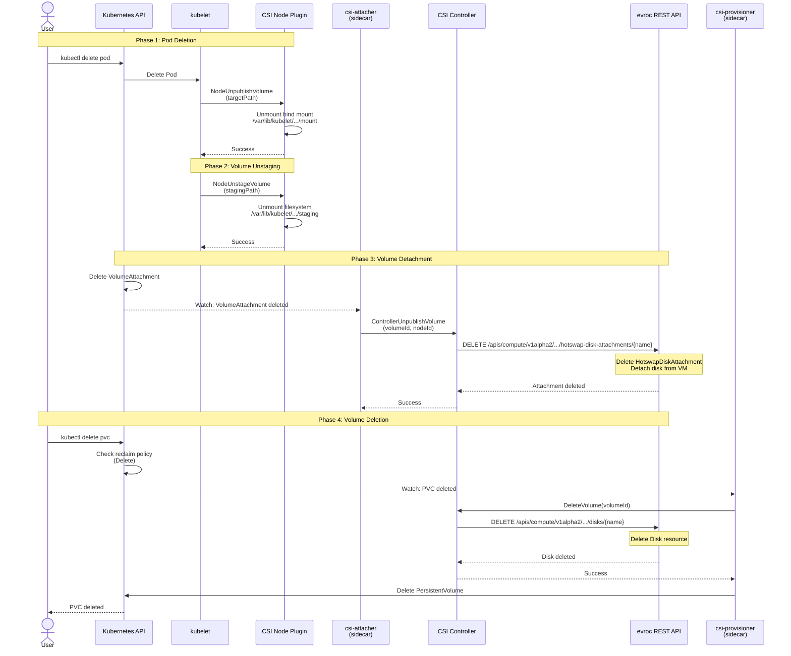
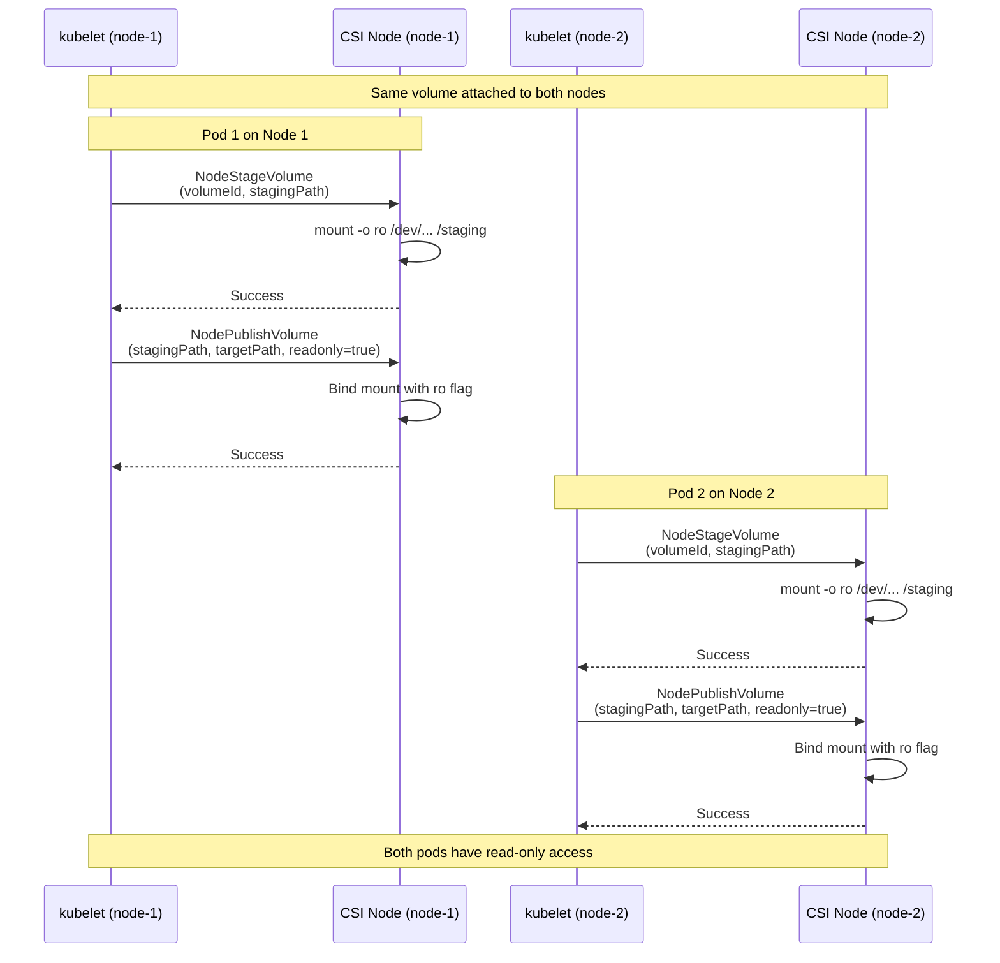
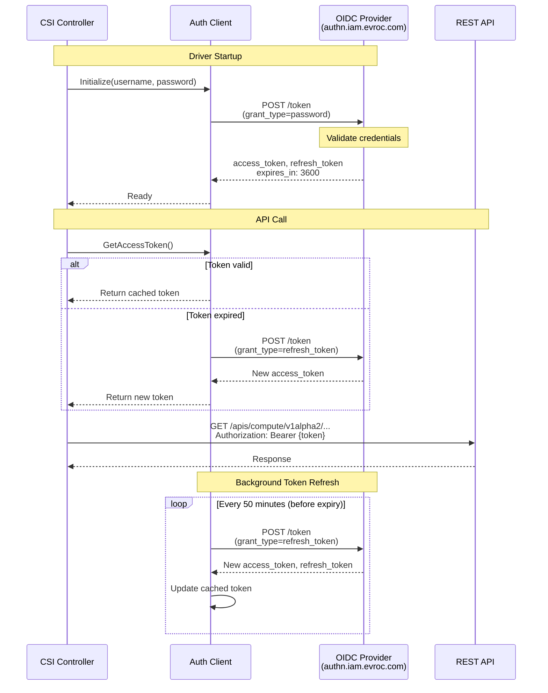
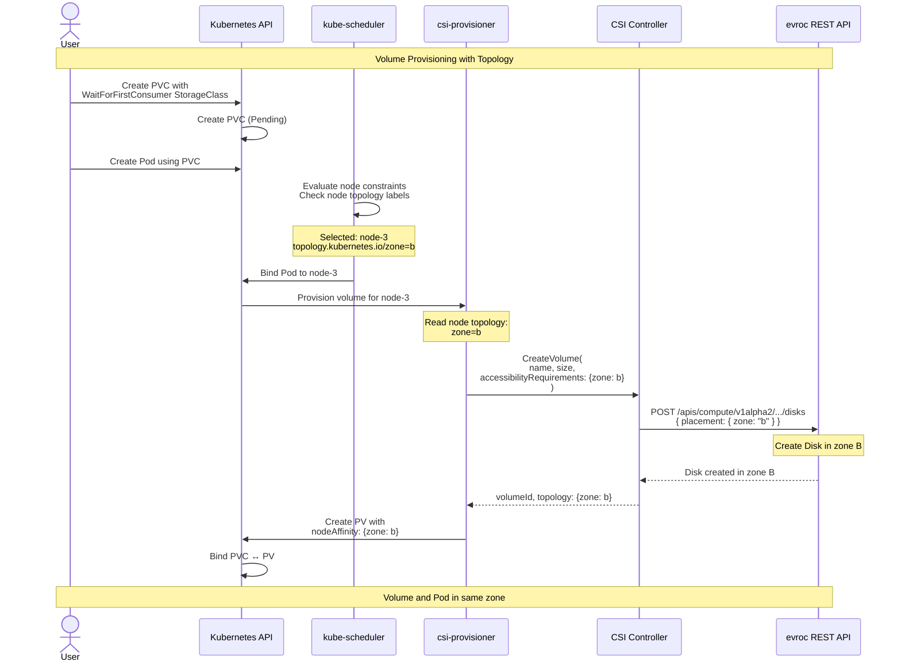
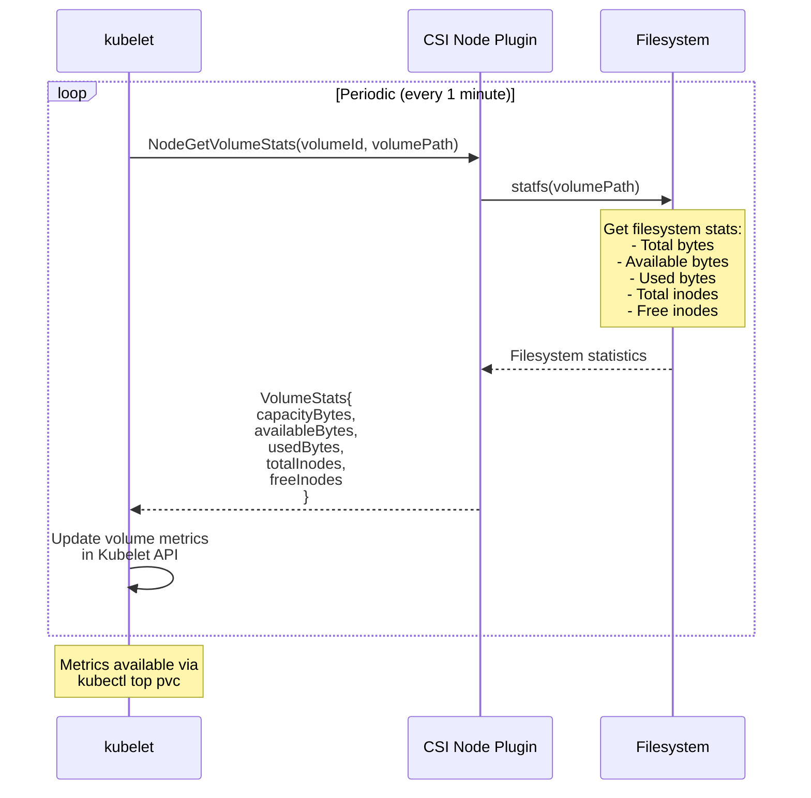
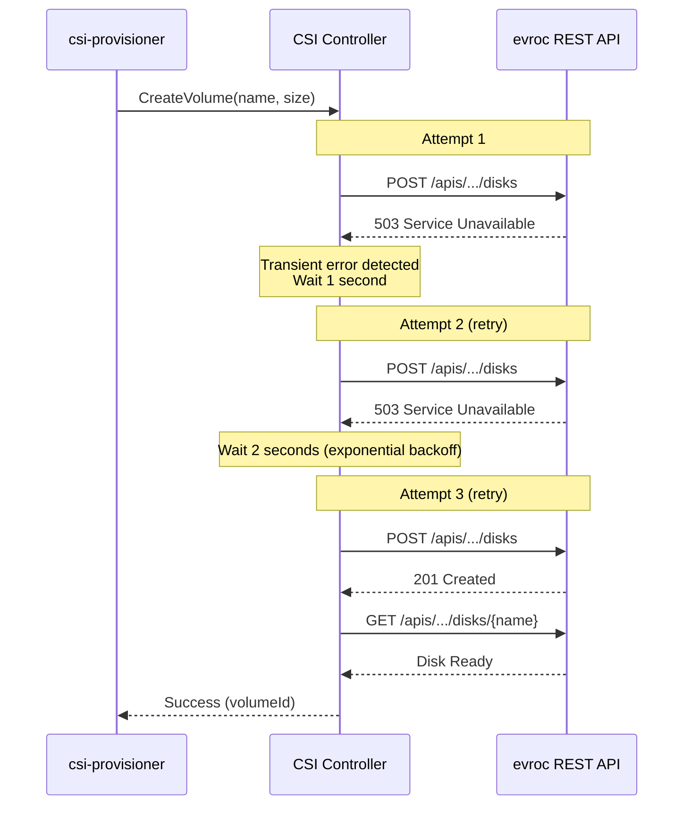
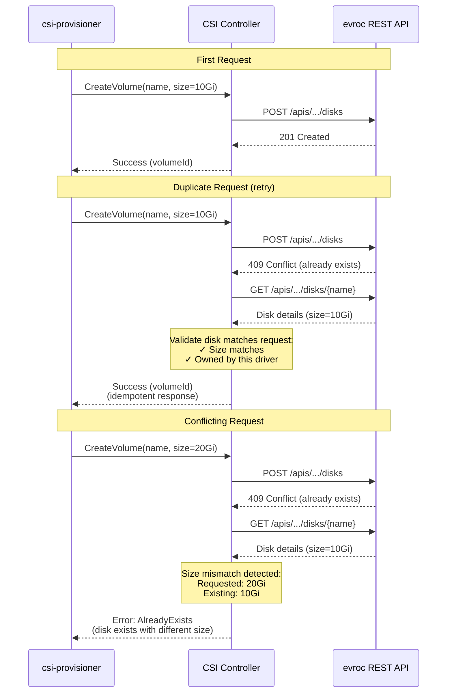

# evroc CSI Driver - Sequence Diagrams

This document shows the interaction flows in the evroc CSI driver for common volume operations.

## 1. Volume Provisioning & Pod Startup (Complete Flow)

This shows the end-to-end flow from creating a PVC to running a pod with a mounted volume.

**Key Points**:
- **CreateVolume**: Creates actual Disk resource via REST API with zone placement
- **ControllerPublish**: Creates HotswapDiskAttachment to attach disk to VM
- **NodeStage**: Formats device with ext4 and mounts at staging path
- **NodePublish**: Bind-mounts from staging to pod target path
- Pod has real ext4 filesystem mounted at `/data`

---

## 2. Volume Deletion (Cleanup Flow)

This shows what happens when a user deletes a PVC.

**Cleanup Timing**:
- NodeUnpublish: Immediate (unmount bind mount)
- NodeUnstage: Immediate (unmount filesystem)
- ControllerUnpublish: ~1-5 seconds (delete attachment via REST API)
- DeleteVolume: ~5-10 seconds (delete disk via REST API)
- PV deletion: Up to 30 seconds (async garbage collection)

---

## 3. Read-Only Volume Mount (ROX Access Mode)

This shows how multiple pods can mount the same volume as read-only.

**Key Points**:
- ROX (ReadOnlyMany) only supported for filesystem volumes
- Each node mounts the device read-only
- Multiple pods across nodes can read simultaneously
- Block volumes don't support ROX (would require loop devices)

---

## 4. OIDC Authentication Flow

This shows how the driver authenticates with evroc platform.

**Security Features**:
- Automatic token refresh before expiration
- Tokens cached in memory only (never persisted)
- Thread-safe token management
- Automatic retry on authentication failures

---

## 5. Topology-Aware Volume Provisioning

This shows how zone information flows for multi-zone deployments.

**Key Points**:
- `WaitForFirstConsumer` delays provisioning until pod is scheduled
- Kubernetes scheduler selects node based on pod requirements
- CSI provisioner reads node's `topology.kubernetes.io/zone` label
- Controller creates disk in same zone as node
- Ensures pod and volume are co-located for best performance

---

## 6. Volume Statistics Reporting

This shows how volume usage metrics are collected.

**Metrics Available**:
- Total capacity in bytes
- Available space in bytes
- Used space in bytes
- Total inodes
- Available inodes
- Used inodes

---

## 7. Error Handling & Retry Logic

This shows exponential backoff retry for transient errors.

**Retry Strategy**:
- Max retries: 3 attempts
- Initial delay: 1 second
- Max delay: 10 seconds
- Exponential backoff (1s → 2s → 4s → 8s → 10s cap)
- Only retries transient errors (5xx, timeouts)
- Permanent errors (4xx) fail immediately

---

## 8. Idempotent Operations

This shows how the driver handles duplicate requests safely.

**Idempotency Guarantees**:
- Duplicate requests with same parameters return success
- Conflicting requests (different parameters) return error
- All operations safe to retry
- Ownership validation prevents cross-cluster conflicts

---

## Summary

These diagrams illustrate the production CSI driver implementation with:

1. **Real Storage Operations**: Disk and HotswapDiskAttachment resources via REST API
2. **OIDC Authentication**: Secure authentication with automatic token refresh
3. **Filesystem Operations**: ext4 formatting, mounting, and statistics
4. **Topology Awareness**: Zone-based volume placement
5. **Error Handling**: Exponential backoff retry for transient errors
6. **Idempotency**: Safe retry behavior for all operations
7. **Multi-Zone Support**: Co-located volumes and pods for best performance

All operations integrate with the evroc platform via REST API (v1alpha2) for production-ready persistent storage.
